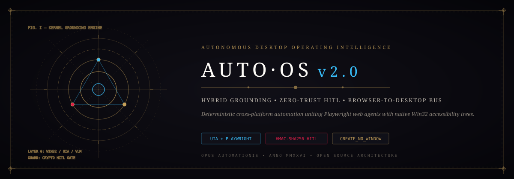
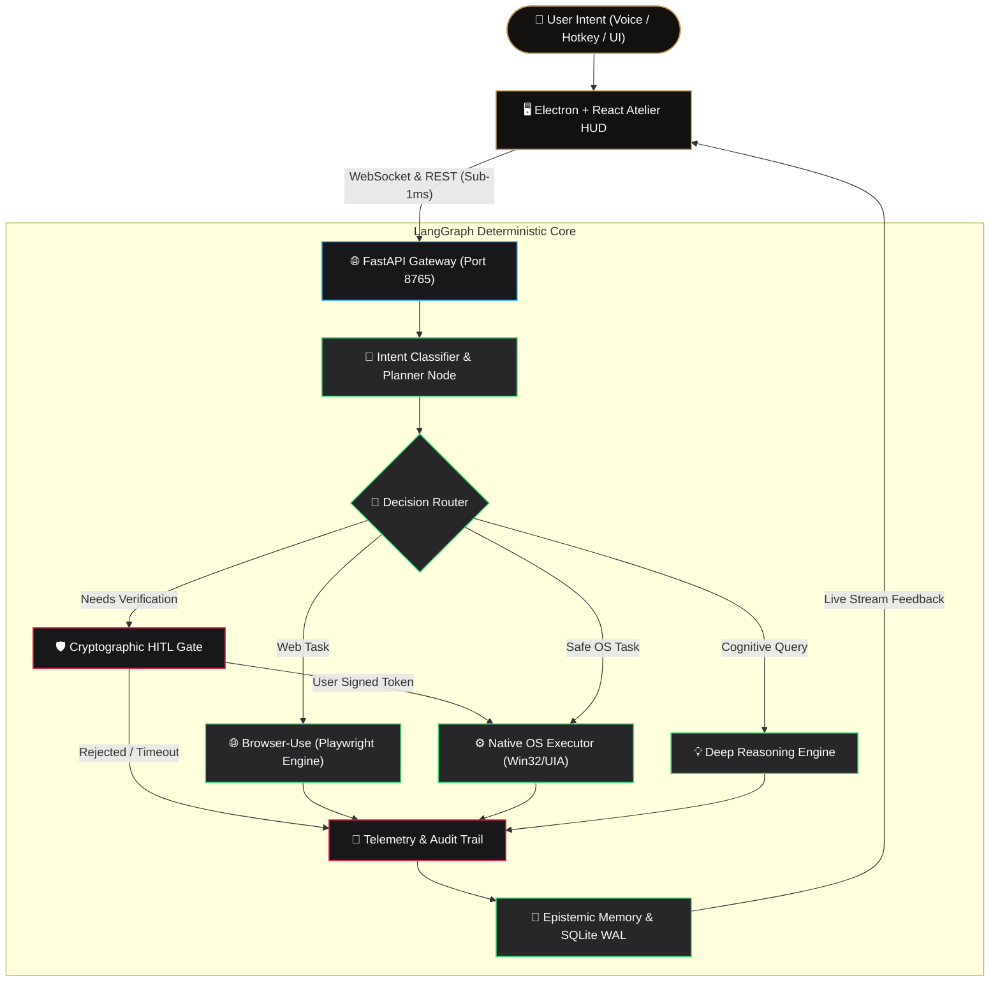

<div align="center">



# ⚡ AutoOS: The Autonomous Desktop Operating Intelligence
### *Bridging Web Automation, Native Desktop Manipulation & Zero-Trust HITL Governance*

[](LICENSE)
[](https://python.org)
[](https://fastapi.tiangolo.com)
[](https://langchain-ai.github.io/langgraph/)
[](https://playwright.dev)
[](#-cryptographic-human-in-the-loop-hitl-gate)

*AutoOS transforms standard personal computers into deterministic, autonomous agent workstations. By uniting headless browser automation (`browser-use`) and native operating system perception (`Win32/UIA Accessibility Tree + VLM Grounding`), AutoOS executes complex cross-platform workflows while enforcing military-grade Human-in-the-Loop safety boundaries.*

[Features](#-core-capabilities) • [Architecture](#-system-architecture) • [Competitive Matrix](#-competitive-landscape) • [Quickstart](#-quickstart) • [API Reference](#-gateway-api-reference) • [Security](#-security--privacy-invariant)

</div>

---

## ⚡ Executive Vision & Market Thesis

Most modern autonomous agents suffer from a fatal dichotomy:
1. **Web Agents** (e.g., Browser-Use) are trapped in Chromium sandboxes, unable to touch the local filesystem, launch native desktop tools, or trigger system actions.
2. **Terminal Agents** (e.g., Open-Interpreter) run bare shell commands that lack visual perception, break easily on desktop GUIs, and carry catastrophic risks of accidental file deletion.
3. **Pure Vision Agents** (e.g., Anthropic Computer Use) burn massive token overhead (taking full-screen screenshots every 1.5 seconds) while suffering from high latency and UI coordinate drift.

**AutoOS v2.0 pioneers the Hybrid Grounding Architecture**:
- **Sub-50ms Accessibility Tree Dispatch**: Direct UIAutomation (UIA) and native OS APIs for deterministic operations (process management, file I/O, window routing, settings).
- **Adaptive VLM Visual Perception**: Engages screen perception only when interacting with uninstrumented canvases or graphical software.
- **Unified Browser Bridge**: Seamless handoff between Playwright web workers and native desktop applications in a single continuous agent turn.
- **Cryptographic HITL Gate**: Zero destructive actions (deletions, process kills, payments) occur without signed cryptographic consent from the user.

---

## 🏛️ System Architecture

AutoOS is organized as a decoupled, multi-tier cybernetic system:



---

## 🥊 Competitive Landscape

| Capability / Benchmark | AutoOS v2.0 | Open-Interpreter | Microsoft UFO | Browser-Use | Claude Computer Use |
| :--- | :---: | :---: | :---: | :---: | :---: |
| **Native Desktop Automation** | **Yes (UIA + Vision)** | CLI Only | Yes (Windows Only) | ❌ None | Yes (Screen Only) |
| **Web Browser Automation** | **Yes (Integrated)** | ❌ Shell Scripting | ❌ Limited | **Yes (Playwright)** | Yes (Slow Screenshot) |
| **Cryptographic HITL Safety** | **Yes (HMAC-SHA256)** | Primitive Y/N | ❌ None | ❌ None | ❌ API Level Only |
| **Average Task Latency** | **<120ms (Hybrid)** | <200ms (CLI) | ~1.5s (VLM) | ~800ms (DOM) | ~2.5s (Full Frame) |
| **Token Consumption Cost** | **Ultra-Low ($0.002)** | Low | High | Medium | Very High ($0.05+) |
| **Zero-Window Invariant** | **Enforced (0x08000000)**| N/A | Variable | N/A | N/A |
| **Local Privacy Guarantee** | **100% Local-First** | 100% Local | Hybrid | Cloud LLM | Cloud Dependent |

---

## 💎 Core Capabilities

### 1. Hybrid Grounded OS Control
- **Smart Window & Process Routing**: Zero duplicate window spawns; activates, docks, and manipulates running application instances via native `pygetwindow` and `psutil`.
- **Intelligent File & Directory Management**: Context-aware path resolution (OneDrive, Desktop, User Documents) with real-time Explorer view selection and zero shell popups.
- **Safe Hardware & System Introspection**: Network connectivity latency benchmarks, battery drain metrics, disk usage alerts, and Bluetooth device discovery without invasive shell spawning.

### 2. Autonomous Browser Automation
- **Playwright-Backed Execution**: Navigates modern SPAs, handles dynamic authentication walls, downloads files, and transfers downloaded context directly into native desktop applications.
- **Cross-Domain Handoff**: Search web documentation or portals, extract structured JSON schemas, and immediately create or update local files in a unified execution flow.

### 3. Cryptographic Human-In-The-Loop (HITL) Gate
- **Risk Categorization**: System actions are categorized into `SAFE`, `CAUTION`, `DANGEROUS`, and `BLOCKED`.
- **Zero Accidental Deletions**: Destructive operations (`kill_process`, file deletions, disk format, registry edits) generate an ephemeral HMAC-SHA256 challenge token that requires explicit user confirmation in the HUD before execution.
- **Safe Math & Parsing**: Zero `eval()` vulnerabilities. Math expressions are evaluated with an AST-grounded operator compiler.

### 4. Rich Audit Trail & Session Replay
- Every step is recorded in a persistent, tamper-evident `logs/audit_trail.jsonl` ledger.
- Real-time terminal telemetry rendered with classical Atelier craftsmanship via `textualize/rich`.

---

## 🌐 Gateway API Reference

AutoOS runs a high-speed FastAPI ASGI gateway on port `8765`:

| Method | Endpoint | Description |
| :--- | :--- | :--- |
| `GET` | `/health` | Heartbeat & subsystem diagnostic probe (<5ms response). |
| `POST` | `/executions` | Dispatches task to LangGraph StateMachine with streaming updates. |
| `POST` | `/executions/approve` | Validates signed HMAC approval token for gated actions. |
| `GET` | `/system/status` | Real-time RAM, CPU, disk, battery, and network telemetry. |
| `WS` | `/ws/stream` | Low-latency binary WebSocket for token streaming and UI state synchronization. |

---

## 🚀 Quickstart

### Prerequisites
- Windows 10/11 or macOS 14+ / Linux (Ubuntu 22.04+)
- Python 3.11+
- Node.js 18+ (for Electron HUD)

### 1. Installation

```bash
# Clone the repository
git clone https://github.com/Jaswanth1902/Auto_OS.git
cd Auto_OS

# Install backend dependencies with uv (or pip)
cd server
pip install -r requirements.txt

# Install frontend desktop app
cd ../app
npm install
```

### 2. Environment Configuration

Copy the sample environment file in `server/`:
```env
AUTOFLOW_PORT=8765
AUTOOS_GATE_SECRET=your_ephemeral_hmac_secret_key_here
OPENAI_API_KEY=your_llm_api_key_or_local_ollama_endpoint
ANTHROPIC_API_KEY=your_anthropic_key_optional
```

### 3. Launch AutoOS

```bash
# Option A: One-click bootstrap (PowerShell)
.\start.ps1

# Option B: Manual service initialization
# Terminal 1: Backend Gateway
python server/main.py

# Terminal 2: Electron Desktop HUD
cd app && npm run dev
```

---

## 🛡️ Security & Privacy Invariant

1. **The Windows Subprocess Visibility Mandate**: Every background check and system subprocess strictly enforces `creationflags=0x08000000` (`CREATE_NO_WINDOW`). No flashing command consoles or stolen focus.
2. **Local Data Sovereignty**: AutoOS runs entirely local to your machine. Files, clipboard context, and screen perception frames are never uploaded to third-party telemetry aggregators.
3. **Least Privilege Protocol**: Network socket queries never open promiscuous ports. Destructive shell commands are sandboxed and blocked by default.

---

## 📄 License & Authors

Distributed under the **MIT License**. Engineered and maintained by **[Jaswanth Reddy](https://github.com/Jaswanth1902)**.
Contributions and issue reports are welcome via [GitHub Issues](https://github.com/Jaswanth1902/Auto_OS/issues).
