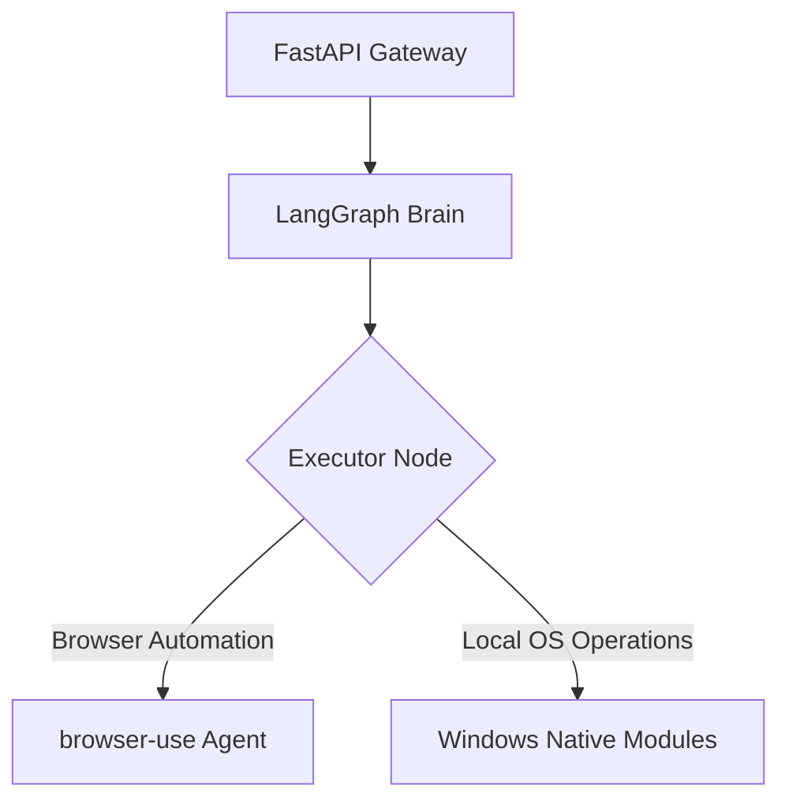

# AutoOS Native Utility System DESIGN

The AutoOS Native Utility System delivers standard high-performance Win32 API based desktop control operations, replacing Simular AI's external agent-s dependencies to achieve sub-second execution latency, absolute stability, and robust execution context safety on Windows.

## Architectural Components

### 1. Windows Native Modules (`server/agent/modules/`)
Highly optimized Win32 execution engine:
* **`file_module.py`**: Blazing fast search leveraging Windows ADODB Search Indexing (`SELECT System.ItemPathDisplay FROM SystemIndex`). Fallback to recursive directory walk.
* **`process_module.py`**: Safe process lifecycle management using Windows API handle termination (`taskkill`). Gracefully handles administrative access constraints.
* **`hardware_module.py`**: Low-latency diagnostics fetching motherboard details via `wmi` (COM library wrapper) and Kernel32 battery states.
* **`settings_module.py`**: Universal settings registry linking natural queries to `ms-settings:` URI schemes, with direct Windows registry (`winreg`) toggles for dark mode and transparency.
* **`security_module.py`**: Real-time Windows Defender CLI MpCmdRun control checks and Windows Update services (`usoclient`).

### 2. Multi-Modal Audio Pipeline (`server/voice/`)
High-fidelity Voice-to-Text translation engine:
* **Primary**: Multimodal audio transcription leveraging the `google-genai` SDK and `gemini-2.0-flash-lite`.
* **Secondary**: Fully local transcription fallback utilising a CPU-optimized `faster-whisper` model.

### 3. Face Authentication Gateway (`server/routers/face_auth.py`)
Zero-latency local visual verify loop:
* Detects camera streams and registers facial models in local embeddings database.
* Real-time validation verification checks using high-precision spatial distance matching.
